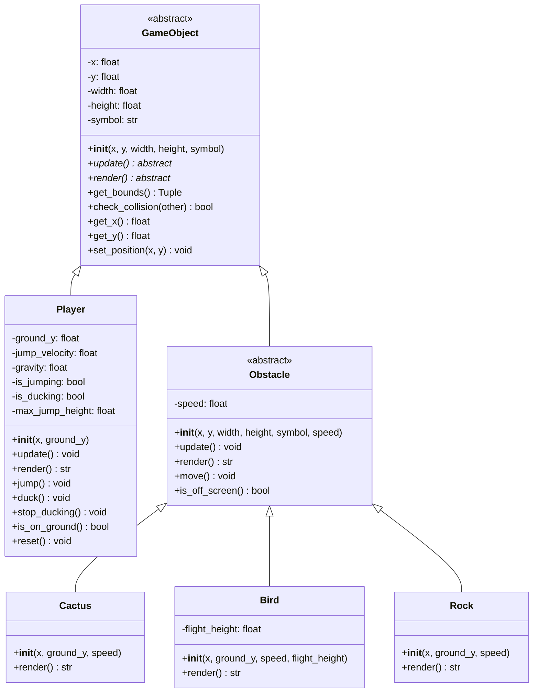
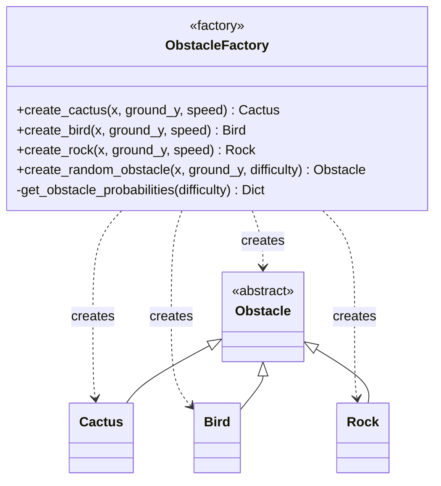
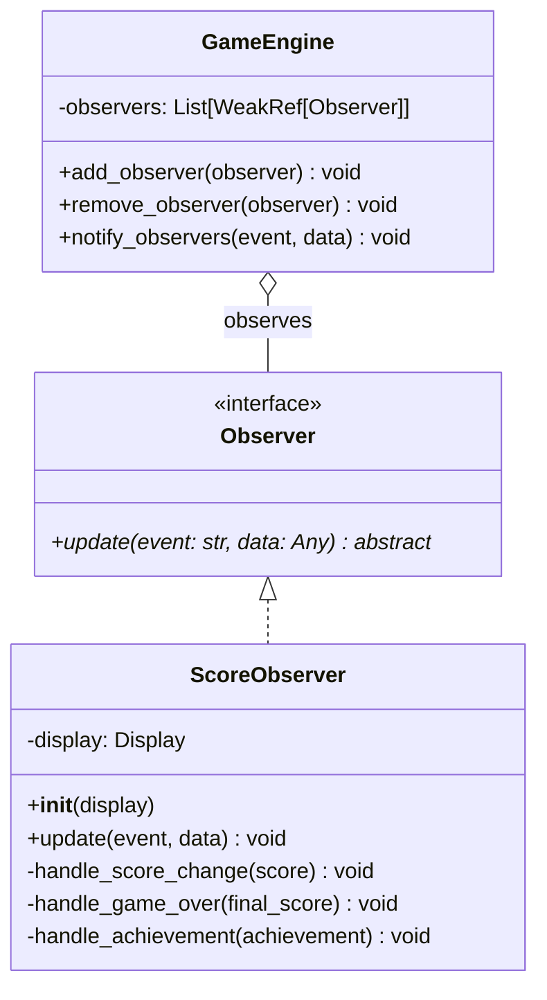
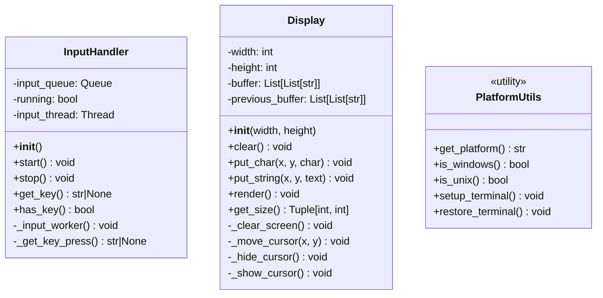
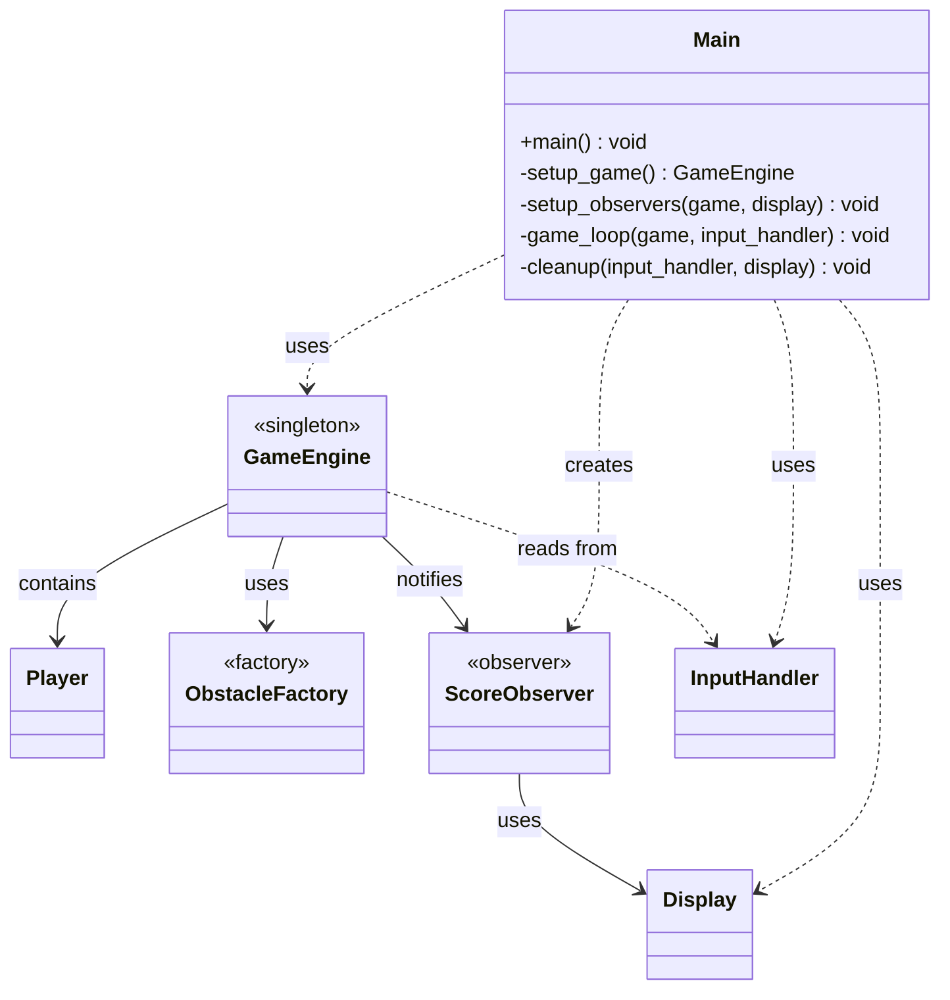

# UML Class Diagrams

This document contains the UML class diagrams for the T-Rex Runner game, showcasing the object-oriented design and design pattern implementations.

## Overall System Architecture



## Design Pattern Implementations

### 1. Singleton Pattern - GameEngine

```mermaid
classDiagram
    class SingletonMeta {
        <<metaclass>>
        -_instances: Dict
        -_lock: Lock
        +__call__(*args, **kwargs) instance
    }

    class GameEngine {
        <<singleton>>
        -running: bool
        -score: int
        -high_score: int
        -game_speed: float
        -obstacles: List[Obstacle]
        -player: Player
        -observers: List[Observer]
        -obstacle_spawn_timer: float
        -obstacle_spawn_interval: float
        -difficulty_level: int
        -achievements: Dict
        +get_instance() GameEngine
        +start_game() void
        +stop_game() void
        +update() void
        +render() void
        +add_observer(observer) void
        +remove_observer(observer) void
        +notify_observers(event, data) void
        -spawn_obstacle() void
        -check_collisions() bool
        -update_score() void
        -increase_difficulty() void
        -handle_achievement(score) void
        -save_high_score() void
        -load_high_score() void
    }

    SingletonMeta ||-- GameEngine : metaclass
```

### 2. Factory Pattern - ObstacleFactory



### 3. Observer Pattern - Event System



## Utility Classes



## Complete System Integration



## Key Design Principles Demonstrated

### SOLID Principles

1. **Single Responsibility Principle (SRP)**
   - `GameObject`: Manages basic entity properties and behavior
   - `Player`: Handles only player-specific logic (jumping, ducking)
   - `ObstacleFactory`: Responsible only for creating obstacles
   - `InputHandler`: Manages only input collection and processing
   - `Display`: Handles only rendering and screen management

2. **Open/Closed Principle (OCP)**
   - `GameObject` abstract class is closed for modification but open for extension
   - New obstacle types can be added by extending `Obstacle` class
   - New observers can be added without modifying existing code

3. **Liskov Substitution Principle (LSP)**
   - All `Obstacle` subclasses can be used interchangeably
   - `Player` can be used anywhere `GameObject` is expected
   - Factory pattern ensures proper substitutability

4. **Interface Segregation Principle (ISP)**
   - `Observer` interface contains only the methods observers need
   - `GameObject` abstract class defines minimal required interface
   - Utility classes have focused, specific interfaces

5. **Dependency Inversion Principle (DIP)**
   - `GameEngine` depends on `Observer` abstraction, not concrete implementations
   - `ObstacleFactory` returns `Obstacle` interface, not specific types
   - High-level modules don't depend on low-level implementation details

### Design Pattern Benefits

1. **Singleton Pattern**

   - Ensures single game instance and centralized state management
   - Thread-safe implementation prevents race conditions
   - Global access point for game state

2. **Factory Pattern**

   - Encapsulates complex obstacle creation logic
   - Easy to add new obstacle types without changing existing code
   - Centralizes creation parameters and difficulty balancing

3. **Observer Pattern**

   - Loose coupling between game events and UI updates
   - Easy to add new event listeners (achievements, analytics, etc.)
   - Real-time notifications without tight dependencies

## Class Relationship Summary

| Pattern | Classes Involved | Relationship Type | Purpose |
|---------|------------------|-------------------|---------|
| Inheritance | `GameObject` → `Player`, `Obstacle` | Is-a | Code reuse and polymorphism |
| Inheritance | `Obstacle` → `Cactus`, `Bird`, `Rock` | Is-a | Specialized obstacle behaviors |
| Composition | `GameEngine` → `Player`, `obstacles[]` | Has-a | Game state management |
| Aggregation | `GameEngine` → `observers[]` | Uses | Event notification system |
| Dependency | `GameEngine` → `ObstacleFactory` | Uses | Obstacle creation |
| Association | `ScoreObserver` → `Display` | Uses | Score display updates |

This architecture demonstrates a well-structured, maintainable, and extensible object-oriented design that effectively implements multiple design patterns while adhering to SOLID principles and OOP best practices.
    │     Cactus      │   │      Bird       │
    │ <<ConcreteProduct>>│ │ <<ConcreteProduct>>│
    └─────────────────┘   └─────────────────┘
```

### Observer Pattern - Event System

```
    ┌─────────────────────────────────────┐
    │           Observer                  │
    │         <<Interface>>               │
    │─────────────────────────────────────│
    │ + onNotify(string, int): void       │
    └─────────────────────────────────────┘
                        △
                        │
              ┌─────────┴─────────┐
              │                   │
    ┌─────────────────┐   ┌─────────────────┐
    │ ScoreObserver   │   │GameEventObserver│
    │ <<Concrete      │   │ <<Concrete      │
    │  Observer>>     │   │  Observer>>     │
    │─────────────────│   │─────────────────│
    │ - currentScore  │   │                 │
    │ - highScore     │   │─────────────────│
    │─────────────────│   │ + onNotify()    │
    │ + onNotify()    │   │   : void        │
    │   : void        │   └─────────────────┘
    │ + resetScore()  │
    │   : void        │
    └─────────────────┘

    ┌─────────────────────────────────────┐
    │           GameEngine                │
    │          <<Subject>>                │
    │─────────────────────────────────────│
    │ - observers: vector<Observer*>      │
    │─────────────────────────────────────│
    │ + addObserver(Observer*): void      │
    │ + removeObserver(Observer*): void   │
    │ + notifyObservers(string, int): void│
    └─────────────────────────────────────┘
                        │
                        │ notifies
                        ▼
    ┌─────────────────────────────────────┐
    │           Observer                  │
    └─────────────────────────────────────┘
```

## Component Interaction Diagram

```
    ┌─────────────┐    creates    ┌─────────────────┐
    │    main()   │──────────────►│   GameEngine    │
    └─────────────┘               │   (Singleton)   │
                                  └─────────────────┘
                                           │
                                           │ manages
                                           ▼
    ┌─────────────┐                ┌─────────────────┐
    │ ScoreObserver│◄──────────────│     Player      │
    │GameEventObs.│   observes     └─────────────────┘
    └─────────────┘                         │
                                           │ interacts with
                                           ▼
                                  ┌─────────────────┐
                                  │   Obstacles     │
                                  │   (Collection)  │
                                  └─────────────────┘
                                           ▲
                                           │ creates
                                  ┌─────────────────┐
                                  │ObstacleFactory  │
                                  │   (Factory)     │
                                  └─────────────────┘
```

## Sequence Diagram - Game Loop

```
main() → GameEngine → Player → ObstacleFactory → Observer

  │         │          │            │              │
  │ getInstance()      │            │              │
  │────────►│          │            │              │
  │         │          │            │              │
  │ run()   │          │            │              │
  │────────►│          │            │              │
  │         │          │            │              │
  │         │ handleInput()         │              │
  │         │────────► │            │              │
  │         │          │            │              │
  │         │ update() │            │              │
  │         │────────► │            │              │
  │         │          │            │              │
  │         │ shouldSpawnObstacle() │              │
  │         │─────────────────────► │              │
  │         │          │            │              │
  │         │ createRandomObstacle()│              │
  │         │─────────────────────► │              │
  │         │          │            │              │
  │         │ checkCollisions()     │              │
  │         │────────► │            │              │
  │         │          │            │              │
  │         │ notifyObservers()     │              │
  │         │─────────────────────────────────────►│
  │         │          │            │              │
```

## Design Pattern Benefits Summary

### Singleton Pattern Benefits
- **Single Instance**: Ensures only one game engine exists
- **Global Access**: Easy access from any part of the program
- **Resource Management**: Centralized control of game resources
- **State Consistency**: Prevents conflicting game states

### Factory Pattern Benefits
- **Flexibility**: Easy to add new obstacle types
- **Encapsulation**: Creation logic is centralized
- **Abstraction**: Client code doesn't need to know concrete types
- **Maintainability**: Changes to creation logic affect only factory

### Observer Pattern Benefits
- **Loose Coupling**: Game engine doesn't depend on specific observers
- **Extensibility**: Easy to add new event handlers
- **Separation of Concerns**: Event handling is separate from game logic
- **Reusability**: Observers can be used in different contexts

This UML documentation provides a clear visual representation of the object-oriented design and design pattern implementations used in the T-Rex Runner game.
